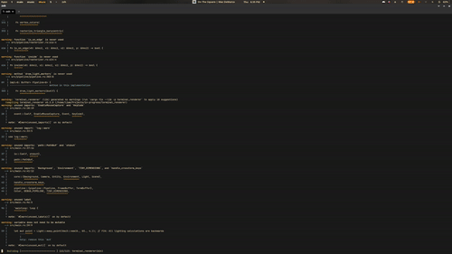
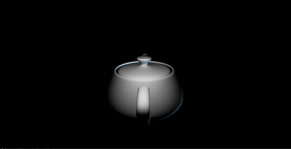

# Terminal Renderer
[](https://wakatime.com/badge/user/d40f8d42-5a14-4981-a36e-39f7bd209ef3/project/71a9c622-7c23-41f4-846d-dbab20a25231)

A 3D software renderer written in Rust, capable of rendering to the terminal using ANSI truecolor or to a graphical window via `minifb`.

Has been a fun side project!

## THIS IS STILL IN ACTIVE DEVELOPMENT
this is just a plunky side project of mine that I work on when I'm not doing stuff for school or my job, and have the energy to do so. There is lots of functionality that still needs to be implemented, many bugs to be squashed, and lots of other stuff to do. I still like to share the things I'm working on, especially if I think they are cool! Hence why I've re-written the README and have tried to write a bit more about the project.

## Features

*   **Dual Output:** Renders 3D scenes either directly in a compatible terminal or in a separate graphical window.
*   **Model Loading:** Loads 3D models from `.obj` files, including basic `.mtl` material support (diffuse, specular, ambient colors, shininess).
*   **Rendering Modes:**
    *   **Solid:** Fills triangles with interpolated colors/lighting.
    *   **Wireframe:** Renders only the edges of triangles.
    *   **Fixed-Point (Experimental):** Renders using fixed-point math for a retro, low-precision effect.
*   **Camera System:** Perspective camera with interactive controls for movement (WASD, Space/Shift) and looking (Arrow Keys / Mouse).
*   **Lighting:**
    *   Supports Directional, Point, and Spot lights.
    *   Includes Flat and Blinn-Phong shading models.
*   **Pipeline:** Implements key stages including vertex transformation, frustum culling, triangle clipping, rasterization (Barycentric / Bresenham), and a G-Buffer for lighting.
*   **Performance:** Utilizes `rayon` for parallel processing in parts of the pipeline.
*   **Interaction:** Keyboard and mouse controls for camera/object manipulation and toggling render states.
*   **Includes Default Models:** Comes packaged with several common `.obj` files (Suzanne, icosphere, teapot, etc.) for easy testing.

## Demos
### Terminal Demo:


### Window Mode Demo:


### More on my Youtube Channel!
https://www.youtube.com/@LiamWirth
above you can see some other videos showing the project, as well as some "historical" videos showingwhat the project used to look like at older stages

## Dependencies

*   **Rust Toolchain:** `cargo` and `rustc`. Install via [rustup](https://rustup.rs/).
*   **(Terminal Mode):** A terminal emulator supporting ANSI Truecolor (24-bit color) is recommended for best results (e.g., Windows Terminal, iTerm2, Kitty, WezTerm).
*   **(Window Mode):** System dependencies required by `minifb` (usually handled automatically on Windows/macOS, may require installing X11 development libraries on Linux - e.g., `libxkbcommon-dev`, `libwayland-dev`, `libxrandr-dev`).

* It is **HIGHLY** Recommended that if you use the terminal mode, to use a terminal emulator that supports ANSI TrueColor, and is ideally optimized for performance/speed. I've had the best success using [WezTerm](https://wezterm.org/). [Kitty](https://sw.kovidgoyal.net/kitty/) and [Windows Terminal](https://docs.microsoft.com/en-us/windows/terminal/).


## Building

```bash
# Clone the repository
git clone https://github.com/Liam-Wirth/terminal_renderer.git
cd terminal_renderer

# Build the project (use --release for performance!)
# Debug build (slower):
cargo build
# Optimized release build (recommended for running):
cargo build --release
```


## Future Plans
- [ ] Implement Texture Mapping
- [ ] Emissive Material Support
- [ ] Scene Support
- [ ] Pre-Defined Primitive Animation Support
- [ ] Debug window with e-frame
- [ ] Ability to define scenes using a JSON or YAML file
- [ ] Unify/Cleanup controls to be more consistent accross the Terminal/Window Mode
- [ ] Re-Introduce command line parsing for determining the mode (currently you have to edit a flag in `src/main.rs`)
- [ ] Add support for pre-rendering scenes to PNG Files/webm video outputs
  - [ ] By Extension, think of a way to create an animation of the text-based scenes, or have some way to be able to playback the "frames" that where rendered


## Controls (Might be out of Date)
| Key / Action | Window Mode | Terminal Mode | Description |
| --- | --- | --- | --- |
| W / S | Yes | Yes | Move Camera Forward / Backward |
| A / D | Yes | Yes | Move Camera Left / Right |
| Space | Yes | Yes | Move Camera Up |
| Left Shift | Yes | Yes (Shift+Space) | Move Camera Down |
| Up Arrow / Down Arrow | Yes | Yes | Pitch Camera Up / Down |
| Left Arrow / Right Arrow | Yes | Yes | Yaw Camera Left / Right |
| O | Yes | Yes | Orbit Camera around Origin |
| Mouse Right Drag | Yes | Yes (If terminal supports mouse) | Look around (Yaw/Pitch Camera) |
| Mouse Left Drag | Yes | Yes (If terminal supports mouse) | Pan selected object (if object move enabled) |
| Mouse Wheel | (Planned/Not Implemented) | (N/A) | Zoom Camera In / Out |
| P | Yes | Yes | Toggle Wireframe Mode |
| J | Yes | Yes | Toggle Object Movement Mode (vs Camera Movement) |
| [ / ] | Yes | Yes | Select Previous / Next Object |
| R | Yes | Yes | Cycle Render Mode for selected object |
| U | Yes | Yes | Reset Camera Position/Orientation |
| 0 / 1 | Yes | Yes | Apply Test Rotations to All Objects |
| 3 | Yes | Yes | Orbit first light source |
| / | Yes | Yes | Print Matrix Debug Info to Console |
| E | Yes | Yes | Print Camera Debug Info to Console |
| NumPad 0 | Yes | Yes | Print Material Info of selected object to Console |
| B | Yes | (No Effect) | Bake Normals to Vertex Colors (Visual Debug) |
| Q / Esc | Yes | Yes | Quit the Renderer |

## Rewrite/Refactor History

### 0.1: Initial Write
- Very buggy, slow, and due to poor optimization, fundamentally incapable of rendering pretty simple models like "suzanne" at a framerate greater than 1.
- Learned a lot.

### 0.2: First Rewrite (Ended ~Nov 12, 2024)
- Much faster in terms of code written, pipeline was still unclear, but the renderer was much more capable.
- Could render the Teapot w/ roughly 6.5k tris at ~50fps in the terminal, applying transformations.
- Never got triangles to fill properly but ultimately abandoned this version due to an unclear pipeline that was hard to maintain.
- TLDR: Code was a great start, but disorganized and needed more clear structure.

### 0.3: Third Time's A Charm (Started Dec 11, 2024 - Current)
- Goals: Clear pipeline, modular design, feature parity with v0.2 plus improvements (clipping, lighting, materials, window mode).

## Acknowledgements / Helpful Resources

### Links I Looked At:
Articles, extremely old lecture material, Wikipedia Pages, etc., all of these played a hand in the project!

*   [Backface Culling?](https://en.wikipedia.org/wiki/Curve_orientation#Orientation_of_a_simple_polygon)
*   [Triangle Filling](https://groups.csail.mit.edu/graphics/classes/6.837/F98/Lecture7/triangles.html)
*   [Viewing frustum](https://en.wikipedia.org/wiki/Viewing_frustum)
*   [Back-face culling](https://en.wikipedia.org/wiki/Back-face_culling)
*   [3D projection](https://en.wikipedia.org/wiki/3D_projection)
*   [Clip coordinates](https://en.wikipedia.org/wiki/Clip_coordinates)
*   [Desmos Graph for Dodecahedron](https://www.desmos.com/3d/8t6uvxkyh6)
*   [Youtube: Rasterization](https://www.youtube.com/watch?v=Hqi8QREXwrE)
*   [Scanline rendering](https://en.wikipedia.org/wiki/Scanline_rendering)
*   [ClipMesh PDF](https://www.geometrictools.com/Documentation/ClipMesh.pdf)
*   [Bounding box of a rotating mesh](https://computergraphics.stackexchange.com/questions/9463/bounding-box-of-a-rotating-mesh)
*   [Smallest enclosing sphere from a mesh](https://gamedev.stackexchange.com/questions/159511/how-can-i-generate-the-smallest-enclosing-sphere-from-a-mesh)
*   [Welzl's Algorithm](https://www.sunshine2k.de/coding/java/Welzl/Welzl.html)
*   [Sunshine2k Coding](https://www.sunshine2k.de/coding_java.html) (Good amount of rasterization algorithms/implementations here)
*   [Tiny Renderer Wiki](https://github.com/ssloy/tinyrenderer/wiki)
*   [Polygon mesh](https://en.wikipedia.org/wiki/Polygon_mesh)
*   [Triangle mesh](https://en.wikipedia.org/wiki/Triangle_mesh)
*   [NVIDIA Cg Tutorial - Lighting](https://developer.download.nvidia.com/CgTutorial/cg_tutorial_chapter05.html) (Especially helpful for spotlighting with attenuation/falloff)
*   [Rhino Weld Command](https://docs.mcneel.com/rhino/mac/help/en-us/commands/weld.htm)
*   [Vertex normal](https://en.wikipedia.org/wiki/Vertex_normal)
*   [Merge adjacent coplanar faces](https://stackoverflow.com/questions/14290365/how-to-merge-adjacent-coplanar-faces-on-a-mesh)
*   [Combine complex polygons](https://stackoverflow.com/questions/2667748/how-do-i-combine-complex-polygons)
*   [The Normal Matrix](https://www.lighthouse3d.com/tutorials/glsl-12-tutorial/the-normal-matrix/)
*   [Vertex Normal Calculation Article](http://www.bytehazard.com/articles/vertnorm.html)
*   [Angle between 3D vectors](https://math.stackexchange.com/questions/974178/how-to-calculate-the-angle-between-2-vectors-in-3d-space-given-a-preset-function)
*   [Fast Frustum Plane Extraction](https://www.gamedevs.org/uploads/fast-extraction-viewing-frustum-planes-from-world-view-projection-matrix.pdf)
*   [Scratchapixel - Rasterization](https://www.scratchapixel.com/lessons/3d-basic-rendering/rasterization-practical-implementation/rasterization-stage.html)
*   [Pineda's Edge Function Paper](https://www.cs.drexel.edu/~deb39/Classes/Papers/comp175-06-pineda.pdf)


### Other Cool Projects (That Helped Along the Way):

| Link                                                                     | Comments/Notes                                                                                                                                                                                                                                                                                                   |
| :----------------------------------------------------------------------- | :--------------------------------------------------------------------------------------------------------------------------------------------------------------------------------------------------------------------------------------------------------------------------------------------------------------- |
| [ryanweideman/3d-terminal-renderer](https://github.com/ryanweideman/3d-terminal-renderer/tree/main) | Of course, I wasn't the only person to try and build this project in rust, and someone much smarter than me did something that ended up being pretty similar. About 16 hours in I stumbled across that first project, and it was really interesting and insightful to see what someone else did. Kudos to them! |
| [TermTrack/TermTrack](https://github.com/TermTrack/TermTrack)            | Super cool project to see, and is awesome to see a much more performant/realtime representation of rendering using crossterm.                                                                                                                                                                                     |
| [JasondeWolff/rusterizer](https://github.com/JasondeWolff/rusterizer)    | Another Rust rasterizer implementation.                                                                                                                                                                                                                                                                          |
| [ecumene/rust-sloth](https://github.com/ecumene/rust-sloth)              | Software rendering library.                                                                                                                                                                                                                                                                                      |
| [Blitzcode Software Rasterizer](http://www.blitzcode.net/3d_1.shtml#Software_Rasterizer) | Blog post by an ex-NVIDIA employee.                                                                                                                                                                                                                                                              |
| [Software Rendering from Scratch](https://medium.com/@aminere/software-rendering-from-scratch-f60127a7cd58) | Useful perspective for potential future rewrites.                                                                                                                                                                                                                                |
| [James Gisele - Software Renderer](https://jamesgisele.com/blog/software_renderer/#list) | Helpful blog series on building a software renderer.                                                                                                                                                                                                                                             |
